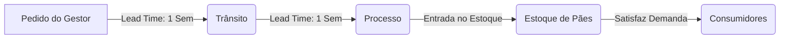
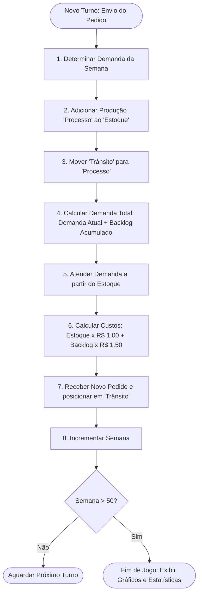

# 🍞 Simulador de Cadeia de Suprimentos - Gerenciamento de Padaria

Este projeto é um simulador educacional de cadeia de suprimentos desenvolvido em ambiente web. Inspirado no clássico jogo **"Beer Game"** (desenvolvido pelo MIT na década de 1960), ele demonstra conceitos fundamentais de logística, gestão de estoque e o **Efeito Chicote (Bullwhip Effect)** por meio do gerenciamento de estoque de farinha e produção de pães em uma padaria.

O simulador é projetado com uma estética premium e moderna, utilizando um tema de cores baseado em tons de trigo e dourado (*Warm Gold & Wheat Theme*), proporcionando uma experiência de jogo imersiva e visualmente rica.

---

## 🎯 Conceitos de Logística Aplicados

### 1. O Efeito Chicote (Bullwhip Effect)
Refere-se ao fenômeno no qual pequenas oscilações na demanda do consumidor final geram distorções amplificadas à medida que subimos na cadeia de suprimentos (pedidos para fornecedores, produção e matérias-primas). No simulador, a demanda sofre um único aumento de 50% na segunda semana e permanece estável, mas a reação em atraso e o pânico do gestor ao fazer pedidos podem gerar grandes picos de estoque desnecessário ou faltas severas.

### 2. Tempo de Resposta (Lead Time)
Há um intervalo de tempo obrigatório entre a decisão de compra de matéria-prima e a disponibilização do produto final:
* **Lead Time = 2 semanas:**
  * Ao fazer um pedido, ele entra em **Trânsito** (Semana $N$).
  * Na semana seguinte (Semana $N+1$), o pedido avança para o **Processo de Produção / Forno**.
  * Somente na semana subsequente (Semana $N+2$), a farinha é assada e entra de fato no **Estoque de Pães**.

### 3. Trade-off de Custos
O gestor deve equilibrar duas forças de custo opostas:
* **Custo de Manutenção do Estoque (Holding Cost):** R$ 1,00 por fornada/semana em estoque. Penaliza o excesso de estoque.
* **Custo de Falta de Estoque / Atraso (Backorder Cost):** R$ 1,50 por fornada/semana de pães não atendidos. Penaliza o mau atendimento ao cliente e acumula para as semanas seguintes até ser quitado.

---

## 📏 Regras e Funcionamento do Jogo

O jogo simula um período de **50 semanas**.



1. **Estado Inicial (Equilíbrio):**
   * Semana: 1
   * Estoque inicial: 10 fornadas
   * Em Processo: 10 fornadas
   * Em Trânsito: 10 fornadas
   * Demanda do Consumidor (Semana 1): 10 fornadas
   * Custos acumulados: R$ 0.00
2. **Choque de Demanda:**
   * Na **Semana 2**, devido a uma campanha de marketing, a demanda do consumidor sobe permanentemente para **15 fornadas** e permanece constante até a Semana 50.
3. **Objetivo:**
   * Ajustar as quantidades dos pedidos de matéria-prima semana a semana de forma a reequilibrar o sistema para o patamar de 15 fornadas, minimizando o custo total acumulado ao final das 50 semanas.

---

## 📂 Estrutura de Arquivos do Projeto

Abaixo estão descritos os principais componentes do projeto:

* **[index.html](file:///home/ivo/Projetos/GerenciamentoPadaria/index.html):** Contém a estrutura semântica da aplicação. Divide-se em três partes principais:
  * *Tela de Cadastro/Registro:* Captura informações do usuário (Nome, Apelido, E-mail, Perfil Profissional e Aceite de Termos do Ranking).
  * *Tabuleiro do Jogo:* Representação visual dos depósitos de estoque, trânsito, demanda e custos. Os valores dinâmicos são sobrepostos em coordenadas exatas sobre a imagem do tabuleiro.
  * *Modais de Informação:* Slides de instruções dinâmicos (1 a 4) e modal de Game Over com resumo de estatísticas e gráficos de performance.
* **[app.js](file:///home/ivo/Projetos/GerenciamentoPadaria/app.js):** Contém a lógica de controle da simulação, a classe de estado `BakeryGame`, a manipulação de eventos do DOM (modais, transições de tela, validação de inputs) e a integração com a biblioteca **Chart.js** para desenhar o gráfico estatístico no final do jogo.
* **[style.css](file:///home/ivo/Projetos/GerenciamentoPadaria/style.css):** Arquivo CSS contendo o design de alta fidelidade do projeto. Implementa o tema de cores baseado em tons de trigo e dourado, fontes do Google Fonts (Poppins), sombras modernas, efeitos de transição/hover de botões e o layout de posicionamento absoluto em pixels para os indicadores numéricos do tabuleiro.
* **[helper.html](file:///home/ivo/Projetos/GerenciamentoPadaria/helper.html):** Utilitário de desenvolvimento para obter as coordenadas X/Y do mouse ao clicar na imagem de fundo do tabuleiro (`layout-01.png`), facilitando a definição das regras de posicionamento absoluto no CSS.
* **[package.json](file:///home/ivo/Projetos/GerenciamentoPadaria/package.json):** Arquivo de configuração do Node.js com dependências de desenvolvimento e scripts para executar a aplicação com a ferramenta build tool **Vite**.

---

## ⚙️ Fluxo de Processamento do Turno

A cada rodada, ao digitar um pedido e clicar em enviar, a classe `BakeryGame` (localizada no [app.js](file:///home/ivo/Projetos/GerenciamentoPadaria/app.js)) executa o método `processTurn(pedido)` seguindo a ordem lógica exata abaixo:



1. **Determinação de Demanda:** Retorna `10` se for a semana 1, ou `15` para qualquer semana posterior.
2. **Entrada de Estoque:** O estoque atual é incrementado com a quantidade que estava na casa de produção/forno (`processo`).
3. **Movimentação Interna da Cadeia:** O lote que estava a caminho (`transito`) avança para a etapa de forno (`processo`).
4. **Cálculo da Demanda Total:** Soma-se a demanda da semana atual com quaisquer pedidos que ficaram pendentes e não foram atendidos em semanas passadas (`backorders`).
5. **Atendimento de Pedidos:**
   * Se o estoque for suficiente, toda a demanda total é atendida. O estoque é reduzido, e a taxa de pedidos não atendidos nesta rodada vai para `0`.
   * Se o estoque for insuficiente, o estoque é zerado, atende-se o máximo possível, e a diferença não atendida se torna o novo saldo de `backorders` (backlog acumulado).
6. **Contabilidade de Custos:**
   * Custo de estoque da semana = `estoque * R$ 1.00`.
   * Custo de falta da semana = `backorders * R$ 1.50`.
   * O custo total acumulado é acrescido da soma destes dois fatores.
7. **Processamento do Novo Pedido:** A quantidade inserida pelo usuário é colocada na casa de `transito` para iniciar a jornada de 2 semanas de lead time.
8. **Avanço de Turno:** O contador de semanas é incrementado. Caso ultrapasse 50, o jogo entra em estado final (`gameOver = true`).

---

## 🎨 Interface Gráfica e Responsividade Adaptativa

O simulador utiliza um tabuleiro visual baseado em uma imagem de alta resolução estática ([layout-01.png](file:///home/ivo/Projetos/GerenciamentoPadaria/assets/images/layout-01.png)). Para posicionar os dados em tempo real sobre os locais exatos desenhatenhos na imagem (como balões de diálogo, prateleiras de estoque e caixas de texto), o CSS utiliza coordenadas de posicionamento absoluto (`position: absolute`) pré-calculadas.

### Coordenadas do Tabuleiro (Largura Base: 1100px, Altura: 600px):
| Campo do Tabuleiro | Atributo Data/ID | Posição no CSS (Top / Left) |
| :--- | :--- | :--- |
| **Semanas** | `#val-semana` | `top: 84px; left: 38px;` |
| **Entrada do Pedido** | `#quantidade-pedido` | `top: 216px; left: 176px;` |
| **Botão de Enviar** | `#btnEnviarPedido` | `top: 263px; left: 174px;` |
| **Em Trânsito** | `[data-casa="transito"]` | `top: 194px; left: 316px;` |
| **Em Processo** | `[data-casa="processo"]` | `top: 230px; left: 510px;` |
| **Estoque** | `[data-casa="estoque"]` | `top: 328px; left: 665px;` |
| **Não Atendidos** | `[data-casa="nao-atendidos"]` | `top: 379px; left: 838px;` |
| **Consumidores** | `[data-casa="consumidores"]` | `top: 251px; left: 955px;` |
| **Demanda** | `[data-casa="demanda"]` | `top: 552px; left: 383px;` |
| **Atrasos (Backorder)** | `[data-casa="backorders"]` | `top: 543px; left: 579px;` |
| **Custo Total** | `[data-casa="total"]` | `top: 552px; left: 738px;` |

### Mecanismo de Escala Responsiva (CSS Scale):
Como os elementos estão posicionados em coordenadas absolutas fixadas em um contêiner de 1100px por 600px, telas menores de computadores ou tablets poderiam cortar o tabuleiro. Para resolver isso de forma elegante:
1. O contêiner do tabuleiro possui a propriedade `transform-origin: top center`.
2. A função JavaScript `adjustBoardScale()` no [app.js](file:///home/ivo/Projetos/GerenciamentoPadaria/app.js) é engatada no evento de redimensionamento da janela (`resize`).
3. Ela calcula o fator de proporção: `escala = largura_do_navegador / 1100`.
4. Se o navegador estiver com largura inferior a 1100px, ela aplica dinamicamente o estilo `transform: scale(escala) translateX(-50%)` ao tabuleiro e ajusta proporcionalmente a altura do contêiner externo para evitar espaços em branco desnecessários.

---

## 📈 Integração de Estatísticas (Chart.js)

Ao final da 50ª semana, o modal de encerramento do jogo exibe um relatório com o gráfico de linhas gerado pelo **Chart.js**. O gráfico cruza três variáveis essenciais ao longo do tempo para o jogador analisar seu desempenho:
* **Estoque (Dourado):** A evolução da quantidade de pães em estoque.
* **Atrasos/Faltas (Vermelho):** O acúmulo de clientes insatisfeitos na fila.
* **Pedidos Efetuados (Azul Tracejado):** As decisões de compras efetuadas pelo jogador.

Esta representação facilita ao aluno enxergar o atraso na cadeia física e as oscilações típicas causadas pela falta de sincronia logística.

---

## 💻 Instalação e Execução Local

### Pré-requisitos
* **Node.js** instalado na máquina (versão 18 ou superior recomendada).

### Passo a Passo
1. Navegue até o diretório do projeto:
   ```bash
   cd /home/ivo/Projetos/GerenciamentoPadaria
   ```
2. Instale as dependências:
   ```bash
   npm install
   ```
3. Inicie o servidor de desenvolvimento:
   ```bash
   npm run dev
   ```
4. Abra o navegador no endereço exibido no terminal (geralmente `http://localhost:5173`).
